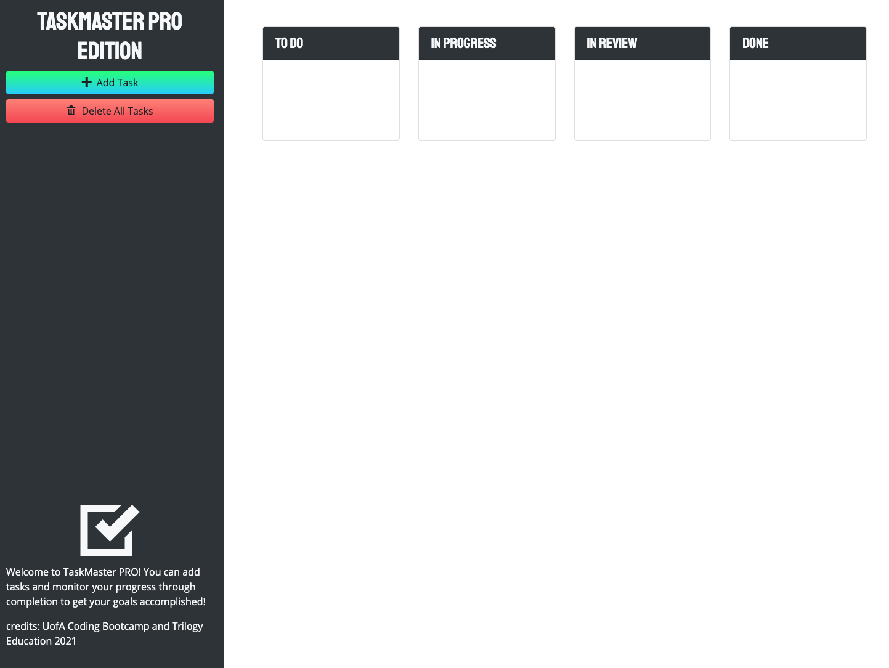

# Task Master

GitHub Repo: [https://github.com/Robert-Schwartz/taskMaster](https://github.com/Robert-Schwartz/taskMaster)  

Deployed at: [https://robert-schwartz.github.io/taskMaster/](https://robert-schwartz.github.io/taskMaster/)  

## Preview

## Description
An interactive HTML/CSS/Javascript webpage to track daily tasks with the ability to organize tasks based on progress and completion.  Completed with lesson plan provided by the University of Arizona Bootcamp.

## Table of Contents
- [Technologies](#Technologies)
- [Installation](#Installation)
- [Usage](#usage)
- [Contributions](#Contributions)
- [Contact](#Contact)
- [License](#license)

## Technologies
This project was built using HTML, CSS, Javascript, Bootstrap styling,

## Installation
clone repo by running `git clone https://github.com/Robert-Schwartz/taskMaster.git' in your command line

## Usage
- Visit deployed website to be taken to the homepage.
- Click Add Task to create a new task item.
- Click and drag tasks from TO DO section through it's progress stages
- Click Delete all Tasks to start over

## Contributions
Developed by Robert Schwartz, 2021

## Contact
Contact me with any questions
- Github Profile: (https://github.com/Robert-Schwartz)
- E-mail me: bschwartz23@gmail.com

## License
NPM MIT